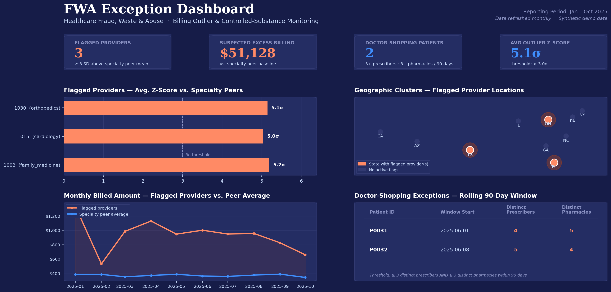

# Combating Healthcare Fraud, Waste & Abuse (FWA)

**Domain:** Healthcare Fraud Investigation / Program Integrity
**Client:** Federal investigative and audit leadership
**Role:** Sole analyst — requirements gathering through delivered exception dashboard

## The Problem

The client needed to identify actionable targets — physicians, hospital networks, or practices — committing systemic billing fraud across Medicare, Medicaid, and TRICARE claims data. Specifically, they needed to pinpoint patterns of **upcoding**, **duplicate billing**, **billing spikes**, **overutilization**, and **"doctor shopping"** for controlled substances, out of millions of lines of raw historical claims.

Unlike a typical BI request, the stakes here were legal: any finding could ultimately support a federal case, so the analysis needed to be statistically defensible and fully reproducible under scrutiny.

## The Ask, As It Actually Came In

Investigators came in with instinct, not specifications — they could describe what suspicious billing "looked like" but not a precise, defensible numeric threshold. See [`docs/requirements.md`](./docs/requirements.md) for how that got translated into hard statistical parameters.

## What I Built

- SQL logic using window functions to compute peer-group billing statistics and flag statistical outliers (3+ standard deviations above the specialty peer mean)
- Z-score normalization to correct for provider panel size, preventing high-volume-but-legitimate clinics from being flagged as false positives
- A defined, reproducible parameter for "doctor shopping" (3+ unrelated providers, opioid prescriptions, rolling 90-day window, 3+ pharmacies)
- A legally rigorous methodology log and data dictionary — documentation standards here were higher than a typical BI project, since findings needed to withstand legal and technical scrutiny
- An interactive FWA exception dashboard (Power BI/Tableau) with geographic drill-down to specific providers and patients

*Dashboard mockup populated with real output from the actual SQL running against the synthetic sample data in this repo, not placeholder numbers.*

## Outcome

The analysis isolated multiple high-yield outlier targets, uncovering major upcoding operations and prescription drug diversion rings,  protecting millions of dollars in taxpayer funds and helping shield vulnerable patient populations from systemic medication abuse.

## Contents

- [`docs/requirements.md`](./docs/requirements.md) — how investigative instinct became a defensible statistical rule
- [`docs/methodology.md`](./docs/methodology.md) — the data challenges and the technical pivot
- [`docs/data_dictionary.md`](./docs/data_dictionary.md) — field and logic definitions
- [`sql/fwa_outlier_detection.sql`](./sql/fwa_outlier_detection.sql) — the core query logic
- [`sample_data/`](./sample_data) — synthetic data + `run_demo.py` to run both queries end-to-end
